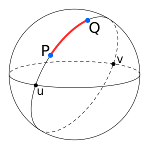

<h1  align="center">❯❯❯ Great Circle Distance</h1>
<p  align="center">A npm package to calculate the distance between two coordinates on the earth. Read more about it <a href="https://en.wikipedia.org/wiki/Great-circle_distance" target="_blank">here.</a></p>
<p  align="center">

Source: Wikipedia
</p>

### Installation and Usage

```sh
npm install great-circle-distance --save
```

or

```sh
yarn add great-circle-distance
```

```sh
const { greatCircleDistance } = require("great-circle-distance");

const coords = {
    lat1: "12.9611159",
    lng1: "77.6362214",
    lat2: "12.9611159",
    lng2: "75.6362214"
};

greatCircleDistance(coords);
// => 216.723363263401 kms
```

### Node.js version

```
any version greater than v7.6.x.
```

### Contribute

Open a pull request against the master.

Also, ⭐ the repo to make it reach to others.

### LICENSE

MIT
